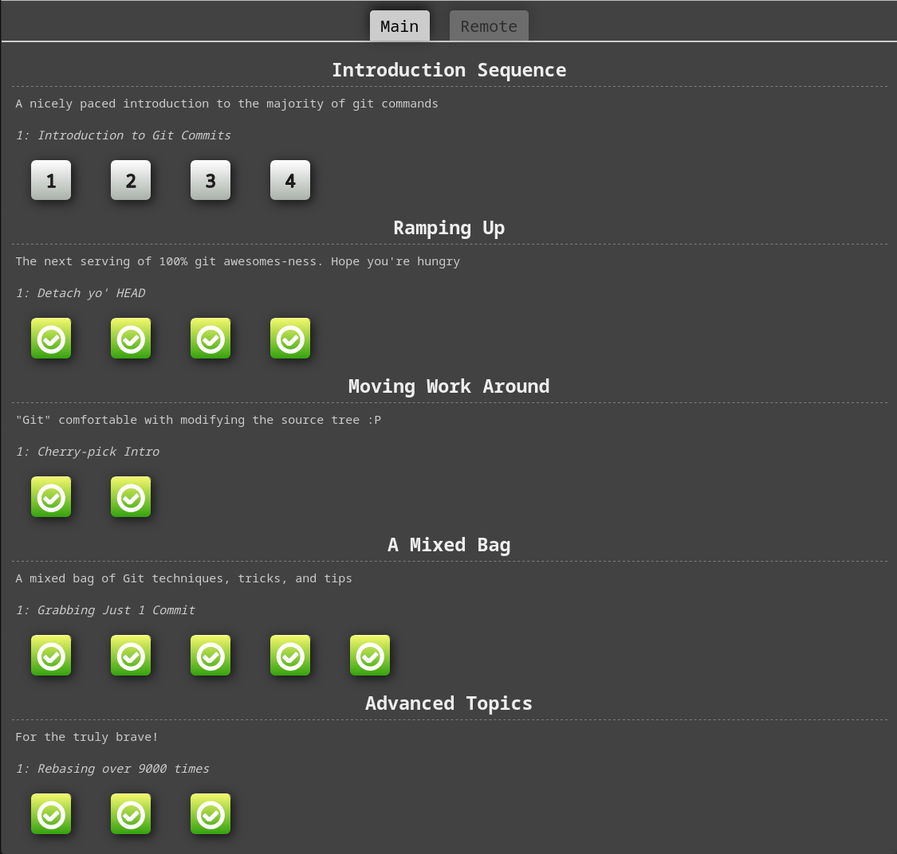

# Exercise 01

## Part 1 - GIT Basics



### Navigation

Check out a specific commit with:

    git checkout <commit>

Relative references can be used to navigate commits:

- `^` - move to the parent of the current commit
- `~<num>` - move upwards a number of times

Targets can be branch names or `HEAD`.

    git checkout HEAD^
    git checkout bugFix-2

This can also be used for creating branches:

    git branch -f main HEAD-3

There are two ways to undo changes in Git:

- `git reset <commit>` - move the current branch to a different commit
- `git revert <commit>` - create a new commit that undoes the changes in another commit

### Moving

Commits can be included from one branch to another with `git cherry-pick <commit>`.

Another way to move commits around is the interactive rebase: `git rebase -i <commit>`.

### Modification

Commits can also be modified using `git commit --amend`.

Depending on the situation, either rebasing or cherry-picking can be the better option.

### More

In order to mark a specific point in history, a tag can be created with `git tag <tag> <commit>`.

Tags serve as great points of reference in the codebase. `git describe <commit>` can be used to describe the current state relative to the closest tag.

## Part 2 - GIT Remotes


A repository can be copied from a remote location with `git clone <url>`.

To receive changes from a remote repository use `git fetch <remote>`.

Multiple commands can be used to merge changes from a remote repository, including `merge`, `rebase`, and `cherry-pick`.

The receiving and merging of changes can be done in one step with `git pull <remote>`.

Use flags to specify how the changes should be pulled in:

The `--rebase` flag can be used rebase the current branch on top of the remote branch.

To send changes to a remote repository use `git push <remote>`.

The `--force` flag can be used to overwrite the remote branch.


## Part 3 - GIT Interactive Rebase

```
# squash commits B and C
pick 940e726 commit B
s 56ad339 commit C

# split commit d
e f5a0a7f commit D

# exchange commits E and F
pick 2ba1b96 commit F
pick a5730d8 commit E

# delete commit G
d 0770d33 commmit G

...
```
 
To split commit D into three parts

1. files 2 and 3 were removed from cache
2. commit D was amended
3. files 2 and 3 were added in single commits

```sh
git rm --cached FileD2.txt FileD3.txt
git commit --amend -m "commit D1"
git add FileD2.txt
git commit -m "commit D2"
git add FileD3.txt
git commit -m "commit D3"
```

After these steps, the Git graph looks like this.

```
* a89949e (HEAD -> master) Update README.md
* fed69a0 updated year
* 3426e86 commit H
* 249c6fa commit E
* ce3a5da commit F
* 442228a commit D3
* aba87a1 commit D2
* 39a51a9 commit D1
* 12aa5ce commit B and C
* 6ed4610 (origin/topic) commit A
* ffe0970 commit 0
```

## Part 4 - GIT ReReRe

ReReRe stands for “reuse recorded resolution” and allows Git to remember conflict resolutions, so they can be resolved automatically.

The feature can be enabled globally with `git config --global rerere.enabled true`.

A possible use-case would be the testing of merging large changes and applying them together afterwards.

The feature can also be helpful in continuous integration, as it automates the frequent merging of changes.