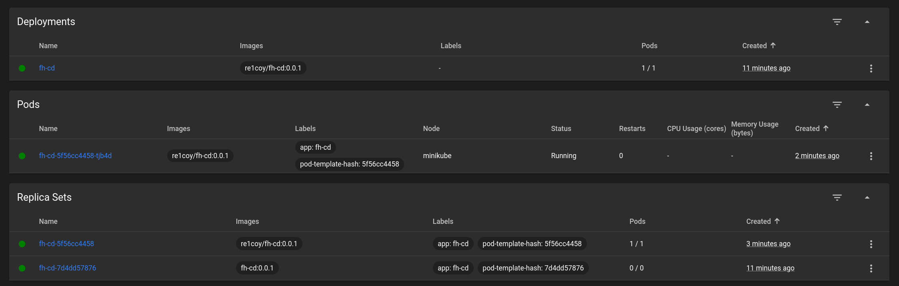
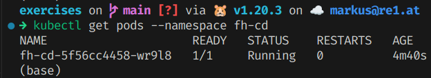

# Kubernetes

## Minikube

Install Minikube as described on the [Minikube website](https://minikube.sigs.k8s.io/docs/start/).

Use `minikube start` to start the cluster.

Minikube also provides a dashboard, which can be accessed via `minikube dashboard`.

The cluster can be stopped with `minikube stop`.

## Kubectl

With the start of the cluster, the `kubectl` command line tool is also set up.

To run the container in the cluster, the following command was used:

```bash
kubectl run fh-cd --image=re1coy/fh-cd:0.0.1 --port=8010  --labels=app=fh-cd
```

The label is needed to be able to select pods by their label later.

Running pods can be listed with `kubectl get pods`.

After the pod as started. The port of the container can be forwarded to the host with the following command:

```bash
kubectl port-forward fh-cd 8010:8010
```

The application can then be accessed from https://localhost:8010.

Note that the application will not be able to access the database, which has been ignored for this exercise.

## Deployment Manifest

In order to deploy the application in a more controlled way, a deployment manifest was created.

```yaml
apiVersion: apps/v1
kind: Deployment
metadata:
  name: fh-cd
spec:
  replicas: 1
  selector:
    matchLabels:
      app: fh-cd
  template:
    metadata:
      labels:
        app: fh-cd
    spec:
      containers:
        - name: fh-cd
          image: re1coy/fh-cd:0.0.1
          ports:
            - containerPort: 8010
```

The deployment can be applied with `kubectl apply -f deployment.yaml`.

Deployments can be listed with `kubectl get deployments`.

To get more information on a specific deployment use `kubectl describe deployment fh-cd`.

As before, the port of the container can be forwarded to the host with the following command:

```bash
kubectl port-forward deployment/fh-cd 8010:8010
```

The application is again available from https://localhost:8010.

As a deployment was applied, the pod will be restarted if it is removed or crashes. This can be tested by deleting the pod with `kubectl delete pod fh-cd-<id>`.

The following screenshot shows the deployment in the Kubernetes dashboard.



## Service Manifest

Next a service manifest was used to expose the application to the outside world using a load balancer service.

For this purpose, the following service manifest was created:

```yaml
apiVersion: v1
kind: Service
metadata:
  name: fh-cd
  labels:
    app: fh-cd
spec:
  selector:
    app: fh-cd
  ports:
    - protocol: TCP
      port: 80
      targetPort: 8010
  type: LoadBalancer
```

The service manifest can be applied with `kubectl apply -f service.yaml`.

As with the deployment manifest, further information can be obtained with `kubectl describe service fh-cd`.

The load balancer will now route requests to pods matching the label `app=fh-cd`.

In order to access the load balancer from outside the cluster, the port of the load balancer must be forwarded to the host. This can be done using a tunnel with `minikube tunnel`.

The application should then be available from http://localhost:80.

## Namespace

The namespace is used to separate the application from other applications running in the cluster. It is again created in a manifest that can be applied with `kubectl apply -f namespace.yaml`.

```yaml
apiVersion: v1
kind: Namespace
metadata:
  name: fh-cd
```

A list of namespaces can be retrieved with `kubectl get namespaces`.

In order to deploy the application in the namespace, the namespace must be specified in the deployment manifest.

```yaml
metadata:
  namespace: fh-cd
```

The adjustment can then be applied with `kubectl apply -f deployment.yaml`.

Commands to retrieve deployments and pods can be extended with `--namespace fh-cd` to only retrieve resources from the namespace.

As can be seen in the following screenshot, the pods created from the deployment are now in the namespace.


